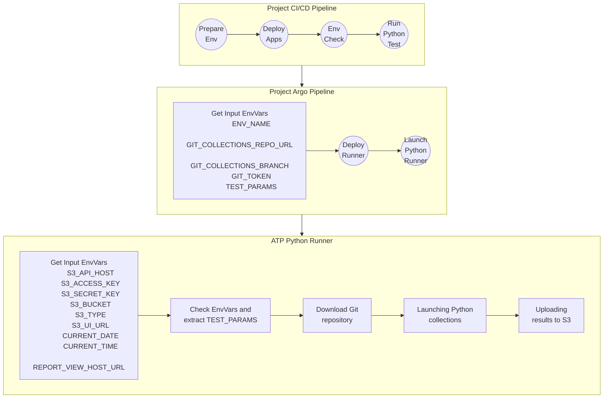

# Qubership Testing Platform Python Collections Runner

Qubership Testing Platform Python Collections Runner is a CI/CD utility designed to automate and manage the deployment and execution of Python-based test collections. It streamlines setting up test environments, deploying applications, validating infrastructure, and securely running Python tests in cloud-native environments. The runner integrates with Git repositories, collects environment variables, and supports parameterized test launches suitable for modern DevOps workflows.
  
Key features include:
- Automated provisioning of test environments and dependencies.
- Execution of Python test suites from modular, versioned collections.
- CI/CD integration to fit seamlessly into existing pipelines.
- Secure handling of credentials and deployment parameters.
- Flexible configuration for a variety of infrastructure and S3-compatible storage backends.


## Table of Contents

- [Description of CI/CD process](#description-of-cicd-process)
  - [Main flow](#main-flow)
  - [Deploy parameters](#deploy-parameters)
  - [Hardware / Resource Requirements (HWE)](#hardware--resource-requirements-hwe)
- [Quick Start](#quick-start)
  - [Prerequisites](#prerequisites)
  - [Setting Up Your Test Repository](#setting-up-your-test-repository)
  - [Example Test Launcher Script](#example-test-launcher-script)
  - [Configuration](#configuration)

## Description of CI/CD process

### Main flow



### Deploy parameters

| Parameter                           | Type    | Mandatory | Default value                             | Description                                                                                                            |
|-------------------------------------|---------|-----------|-------------------------------------------|------------------------------------------------------------------------------------------------------------------------|
| ENVIRONMENT_NAME                    | string  | **yes**   | `"default"`                               | Environment name (e.g., dev, test, prod).                                                                              |
| ENV_CONFIGURATION_TEMPLATE_FILENAME | string  | no        | `environment-configuration-template.json` | Environment configuration template filename used during runtime configuration rendering.                               |
| ATP_TESTS_GIT_REPO_URL              | string  | **yes**   | `""`                                      | Git repository URL for cloning test sources. Git-URL-to-project-tests.git                                              |
| ATP_TESTS_GIT_REPO_BRANCH           | string  | no        | `main`                                    | Git branch to checkout.                                                                                                |
| TEST_PARAMS                         | JSON    | **yes**   | `{}`                                      | Specify what test or scope should be run, for example: `'{"execution_list":[{"type": "scope","name": "regression"}]}'` |
| ATP_ENVGENE_CONFIGURATION           | JSON    | no        | `{}`                                      | Additional test parameters (Systems) to pass to test runner from EnvGene.                                              |
| ATP_TESTS_GIT_REPO_BRANCH           | string  | no        | `main`                                    | Git branch to checkout.                                                                                                |
| ATP_STORAGE_PROVIDER                | string  | no        | `"minio"`                                 | Type of S3 storage (e.g., minio, aws).                                                                                 |
| ATP_TESTS_GIT_TOKEN                 | string  | **yes**   | `""`                                      | Access token for private Git repositories with tests.                                                                  |
| ATP_STORAGE_BUCKET                  | string  | **yes**   | `""`                                      | S3 bucket name for uploading results.                                                                                  |
| ATP_STORAGE_USERNAME                | string  | **yes**   | `""`                                      | Access key for S3 bucket.                                                                                              |
| ATP_STORAGE_PASSWORD                | string  | **yes**   | `""`                                      | Secret key for S3 bucket.                                                                                              |
| ATP_STORAGE_SERVER_URL              | string  | **yes**   | `""`                                      | API endpoint for accessing S3 storage.                                                                                 |
| ATP_STORAGE_SERVER_UI_URL           | string  | **yes**   | `""`                                      | Web UI endpoint for viewing files in the S3 bucket.                                                                    |
| ATP_REPORT_VIEW_UI_URL              | string  | **yes**   | `""`                                      | URL for viewing generated test reports.                                                                                |
| CURRENT_DATE                        | string  | no        | `""`                                      | Date to use in report naming (format: YYYY-MM-DD).                                                                     |
| CURRENT_TIME                        | string  | no        | `""`                                      | Time to use in report naming (format: HH:MM:SS).                                                                       |
| ATP_RUNNER_JOB_TTL                  | integer | no        | `43200`                                   | Time-to-live for the test job in seconds.                                                                              |
| ATP_RUNNER_JOB_EXIT_STRATEGY        | integer | no        | `0`                                       | Delay in seconds before job termination (for debugging).                                                               |
| ENABLE_JIRA_INTEGRATION             | boolean | no        | `false`                                   | Enable Jira integration for tests.                                                                                     |
| DEBUG_MODE                          | boolean | no        | `false`                                   | Enable additional debug behavior and logs in runner scripts.                                                           |
| ATP_MONITORING_ENABLED              | boolean | no        | `false`                                   | Enable creation monitoring objects for runners.                                                                        |
| SECURITY_CONTEXT_ENABLED            | boolean | no        | `false`                                   | Flag to enable or disable the security context for the Playwright Runner service .                                     |


## Hardware / Resource Requirements (HWE)

Supported 2 profiles: `dev`, `prod`.

| Parameter        | Dev    | Prod     |
|------------------|--------|----------|
| MEMORY_REQUEST   | 500Mi  | 100Mi    |
| MEMORY_LIMIT     | 1000Mi | 2000Mi   |
| CPU_REQUEST      | 100m   | 300m     |
| CPU_LIMIT        | 500m   | 1000m    |

### Quick Start

This runner executes Python test collections from a separate Git repository. Follow these steps to set up your test repository:

#### Prerequisites

- A Git repository containing your pytest test suite
- Python 3.x with pytest installed
- Allure reporting support (optional, for test reports)

#### Setting Up Your Test Repository

1. **Create a separate Git repository** for your test collections
   - This repository will be cloned by the runner during execution
   - Ensure the repository is accessible (public or with proper authentication)

2. **Organize your pytest tests**
   - Place your test files in a `tests/` directory (or configure a custom path)
   - If you need additional dependencies, list them in `requirements.txt` and add installation commands to `start_tests.sh`

3. **Create a test launcher script** (`start_tests.sh`)
   - This script will be executed by the runner to launch your tests
   - Place it in the root of your test repository
   - The script should handle test execution and result generation

#### Example Test Launcher Script

Create `start_tests.sh` in your test repository root:

```bash
#!/bin/bash

# Exit immediately if any command fails
set -e

echo "=== Starting Pytest Launcher ==="

# Ensure TEST_PARAMS is set
if [ -z "$TEST_PARAMS" ]; then
  echo "ERROR: TEST_PARAMS environment variable is not set"
  exit 1
fi

echo "TEST_PARAMS: $TEST_PARAMS"

# Show current working directory
echo "Working directory: $(pwd)"

# Optionally activate virtualenv if needed
if [ -d "venv" ]; then
  echo "Activating virtual environment"
  source venv/bin/activate
fi

# Create the allure results directory if it doesn't exist
mkdir -p /tmp/clone/allure-results

# Run pytest with Allure reporting
echo "Running Python test launcher..."
pytest -v tests --alluredir=/tmp/clone/allure-results

echo "=== Test execution complete ==="
```

**Note:** The runner expects test results to be generated in `/tmp/clone/allure-results` for Allure report generation.

#### Configuration

When deploying the runner, provide the following required parameters:

- `ATP_TESTS_GIT_REPO_URL`: URL of your test repository
- `ATP_TESTS_GIT_REPO_BRANCH`: Branch to checkout (default: `main`)
- `ATP_TESTS_GIT_TOKEN`: Access token if using a private repository
- `TEST_PARAMS`: JSON object with test-specific parameters